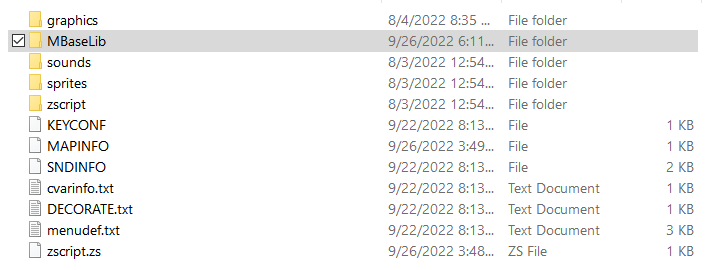

# MBase

MBase is a ZScript library that attempts to provide a highly-flexible foundation for
GZDoom mods, including a robust state machine implementation to manage complex logic
and a generic system for displaying UI elements without custom status bars, among
other utilities.

## Setup

### ZScript Includes

First, bring the MBaseLib folder into the root of your project archive or directory.



Then include the main ZScript file from the library.
```c
#include "MBaseLib/zscript.zs"
```
This file will `#include` all other ZScript files contained in the library. However,
GZDoom's preprocessor will include these after all other includes in the same file.
`#include`s that contain extensions to or classes deriving from types defined in MBase
will need to be included from an additional file after the MBaseLib include, like so:
```c
// zscript.zs

#include "MBaseLib/zscript.zs"

#include "zscript/several.zs"
#include "zscript/other.zs"
#include "zscript/scripts.zs"

#include "zscript2.zs"
```
```c
// zscript2.zs

#include "zscript/things.zs"
#include "zscript/that.zs"
#include "zscript/extend.zs"
#include "zscript/types.zs"
#include "zscript/from.zs"
#include "zscript/mbaselib.zs"

```

### Miscellaneous Edits

You will need to make edits to certain lumps in your project, or add them if missing:

##### MAPINFO

You will need to add the `HUDExtensionRegistry` event handler in the `GameInfo` block.
This is needed for the HUD extension system to function.
```cs
GameInfo
{
	AddEventHandlers = "HUDExtensionRegistry"
}
```
> If starting a new project, you may use the premade files in the `setuptemplate`
> folder instead.

### Optional Setup

#### RPLCA0.png

The `WeaponBase` actor uses the RPLC sprite for states that are meant to be replaced
by deriving actors supplying their own sprite, as a visual reminder that the sprite
needs to be replaced:


Although `WeaponBase` remains fully-functional without it, you are encouraged to
import this sprite to avoid these states appearing blank, which may be misinterpreted
as an unrelated bug during development. You will find it in `extra/sprites/`.
