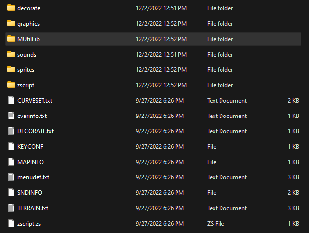

# MUtil

MUtil is a ZScript library that attempts to provide a highly-flexible foundation for
GZDoom mods, including a robust state machine implementation to manage complex logic,
systems to encapsulate HUD logic, tools for triangulating sector geometry, among other
utilities.

## Setup

### ZScript Includes

First, bring the MUtilLib folder into the root of your project archive or directory.



Then include the main ZScript file from the library.
```c
#include "MUtilLib/zscript.zs"
```
This file will `#include` all other ZScript files contained in the library. However,
GZDoom's preprocessor will include these after all other includes in the same file.
`#include`s that contain extensions to types defined in MUtil will need to be included
from an additional file after the MUtilLib include, like so:
```c
// zscript.zs

#include "MUtilLib/zscript.zs"

#include "zscript/several.zs"
#include "zscript/other.zs"
#include "zscript/scripts.zs"

#include "zscript2.zs"
```
```c
// zscript2.zs

#include "zscript/things.zs"
#include "zscript/that.zs"
#include "zscript/extend.zs"
#include "zscript/types.zs"
#include "zscript/from.zs"
#include "zscript/MUtilLib.zs"

```

### Miscellaneous Edits

You will need to make edits to certain lumps in your project, or add them if missing:

##### MAPINFO

You will need to add the following event handlers in the `GameInfo` block.
```cs
GameInfo
{
	AddEventHandlers = "SectorDataRegistry", "WorldAgentHandler"
}
```
> If starting a new project, you may use the premade files in the `setuptemplate`
> folder instead.